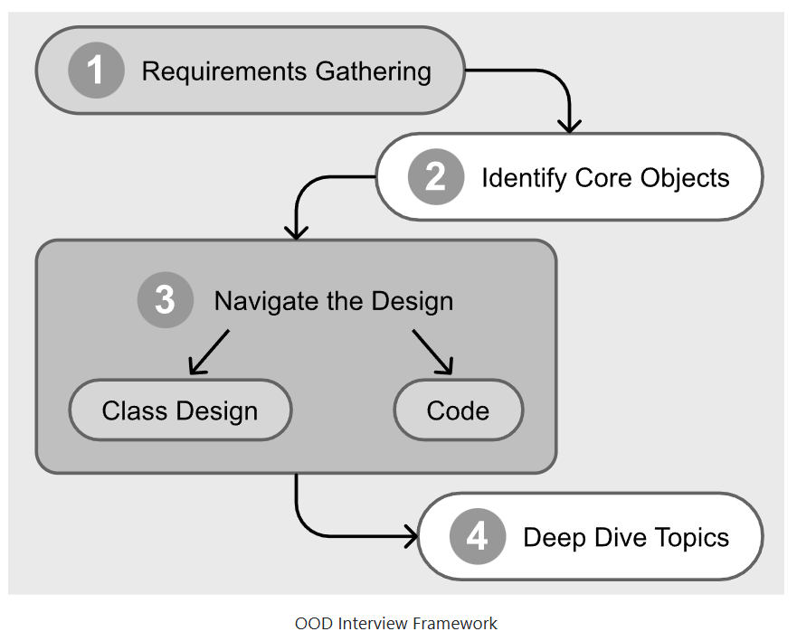

# System Design

A collection of High Level Design (HLD) and Low Level Design (LLD) problems, solutions, and theoretical components.

---

## High Level Design (HLD)

### 🎯 [Questions](High%20Level%20Design/Questions)
Quick reference to HLD design questions and their solutions. Read and understand other resources and GPT your way out. Read about deeper algorithms that may be employed, ex: locking (optimistic/ pessimistic), WAL, vector times etc.
- [Design Ad-Click Aggregator](High%20Level%20Design/Questions/ad-click-aggregator-hld.md) **(sample - todo)**
- [Design FB Live Comments (ref)](https://www.hellointerview.com/learn/system-design/problem-breakdowns/fb-live-comments)
- [Design AD Click Aggregator (ref)](https://www.hellointerview.com/learn/system-design/problem-breakdowns/ad-click-aggregator)
- [Design TicketMaster/ BookMyShow (ref)](https://www.hellointerview.com/learn/system-design/problem-breakdowns/ticketmaster)

### 📚 [Components](High%20Level%20Design/Theoretical%20Components)
- [CAP Theorem](https://www.hellointerview.com/learn/system-design/core-concepts/cap-theorem)
- [Redis (caching)](https://www.hellointerview.com/learn/system-design/deep-dives/redis)
- [Consistent Hashing](https://www.hellointerview.com/learn/system-design/core-concepts/consistent-hashing)
- [Networking (fundamentals)](https://www.hellointerview.com/learn/system-design/core-concepts/networking-essentials)
- [API Design (REST)](https://www.hellointerview.com/learn/system-design/core-concepts/api-design)
- [Database Modeling (fundamentals)](https://www.hellointerview.com/learn/system-design/core-concepts/data-modeling)

---

## Low Level Design (LLD)

### 🎯 [Questions](Low%20Level%20Design/Questions)
Quick reference to LLD design questions and their solutions. Read and practice some problems.
- [Design Ad-Click Aggregator](Low%20Level%20Design/Questions/ad-click-aggregator-lld.md) **(sample - todo)**
- [Design Connect4 Game (ref)](https://www.hellointerview.com/learn/low-level-design/problem-breakdowns/connect-four)
- [Design A Parking Lot System (ref)](https://bytebytego.com/courses/object-oriented-design-interview/design-a-parking-lot)

### 📚 [Components](Low%20Level%20Design/Theoretical%20Components)
- [Design Principles](https://medium.com/@hlfdev/kiss-dry-solid-yagni-a-simple-guide-to-some-principles-of-software-engineering-and-clean-code-05e60233c79f)
- [SOLID Principles](https://www.geeksforgeeks.org/system-design/solid-principle-in-programming-understand-with-real-life-examples/)
- [SOLID Illustration](https://medium.com/backticks-tildes/the-s-o-l-i-d-principles-in-pictures-b34ce2f1e898)  
- [Concurrency](https://www.hellointerview.com/learn/low-level-design/concurrency/intro)
- [Design Pattern : Creational](https://refactoring.guru/design-patterns/creational-patterns)   
- [Design Pattern : Structural](https://refactoring.guru/design-patterns/structural-patterns)  
- [Design Pattern : Behavioural](https://refactoring.guru/design-patterns/behavioural-patterns)  

---

## 📖 How to Use

- **Questions**: Browse design problems with detailed solutions
- **Components**: Reference fundamental concepts and components

---
## Udemy Courses
- [Mastering System Design Interview](https://www.udemy.com/course/system-design-interview-prep/learn/lecture/28975362?start=0#overview)
- [ML, Data Science and AI Engineering with Python (beginner)](https://www.udemy.com/course/data-science-and-machine-learning-with-python-hands-on/learn/lecture/52201423?start=0#overview)

 

