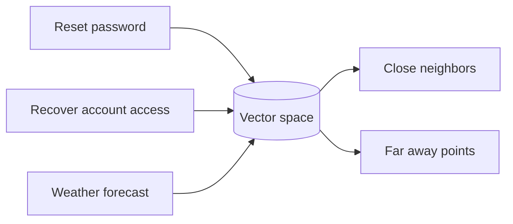
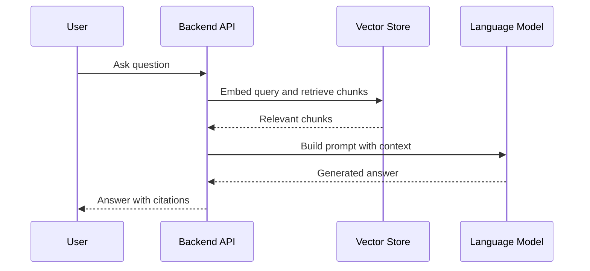

# AI Applications and RAG Architecture

## Quick Navigation Index

Use this guide as a quick map to the most important RAG concepts, from ingestion to production design.

- [1. What RAG is](#1-what-rag-is)
- [2. Why RAG matters](#2-why-rag-matters)
- [3. Core RAG architecture](#3-core-rag-architecture)
  - [3.1 Ingestion pipeline](#31-ingestion-pipeline)
  - [3.2 Query pipeline](#32-query-pipeline)
- [4. Chunking strategies](#4-chunking-strategies)
- [5. Embeddings and vector search](#5-embeddings-and-vector-search)
- [6. Retrieval strategies](#6-retrieval-strategies)
- [7. Reranking and relevance improvement](#7-reranking-and-relevance-improvement)
- [8. Prompt construction](#8-prompt-construction-in-rag-systems)
- [9. End-to-end RAG query flow](#9-end-to-end-rag-query-flow)
- [10. Chatbot architecture](#10-chatbot-architecture)
- [11. Enterprise chatbot design concerns](#11-enterprise-chatbot-design-concerns)
- [12. Retrieval-augmented generation in production](#12-retrieval-augmented-generation-in-production)
- [13. Common failure modes](#13-common-failure-modes)
- [14. Recommended architecture pattern](#14-recommended-architecture-pattern)
- [15. Best practices](#15-best-practices)
- [16. Key takeaways](#16-key-takeaways)

---

## 1. What RAG is

Retrieval-Augmented Generation, or RAG, is an architecture pattern that improves large language model responses by grounding them in external knowledge sources. Instead of relying only on the model’s pretrained parameters, a RAG system retrieves relevant documents or chunks and injects them into the prompt context.

This makes the system more accurate, more up-to-date, and easier to control for enterprise use cases.

---

## 2. Why RAG matters

Large language models are powerful but often limited by:

- outdated training data
- hallucinations
- lack of domain-specific knowledge
- inability to access private organizational data

RAG solves these issues by combining:

- retrieval over a knowledge base
- generation by an LLM
- orchestration logic for prompt construction and post-processing

---

## 3. Core RAG architecture

A typical RAG architecture includes:

1. Document ingestion
2. Chunking and preprocessing
3. Embedding generation
4. Vector indexing
5. Retrieval at query time
6. Prompt construction
7. Generation and response formatting
8. Optional reranking and feedback loops

### 3.1 Ingestion pipeline

The ingestion pipeline prepares raw content for retrieval.

Typical steps include:

- extracting text from PDFs, docs, web pages, databases, or other documents
- cleaning and normalizing text
- splitting into chunks
- generating embeddings
- storing them in a vector store

### 3.2 Query pipeline

The query pipeline works when a user asks a question.

Typical steps include:

- embedding the user query
- retrieving similar chunks from the vector store
- optionally reranking the retrieved chunks
- building a prompt with the retrieved context
- sending the prompt to the LLM
- returning the answer with citations

---

## 4. Chunking strategies

Chunking is one of the most important parts of a RAG system.

### 4.1 Why chunking matters

If the document is too large, the retrieval step may return overly broad or irrelevant context. If it is too small, the system may lose important relationships and semantics.

### 4.2 Common chunking methods

- fixed-size chunks
- sentence-based chunking
- semantic chunking
- section-based chunking
- overlapping windows

### 4.3 Best practices

A good chunking strategy should consider:

- preserving context
- keeping chunks semantically coherent
- avoiding too much overlap or too little overlap
- balancing retrieval quality and prompt size

---

## 5. Embeddings and vector search

### 5.1 What embeddings are

Embeddings are numerical representations of text that place semantically similar content close together in vector space.

A useful way to think about them is:

- a word, sentence, paragraph, or document is converted into a list of numbers
- these numbers capture meaning, not just exact spelling
- similar ideas end up near each other in this mathematical space

So instead of asking “does the text contain the same words?”, the system asks “is this meaning close to that meaning?”

### 5.2 Why embeddings help

Embeddings allow the system to retrieve conceptually similar content even when the exact words differ.

Example:

- user query: “How do I reset my password?”
- relevant document: “Password recovery instructions”

Even though the wording is different, embeddings can still surface the relevant passage.

### 5.3 A simple mental model

Imagine each piece of text is placed at a point in a multi-dimensional space.

- texts with similar meaning are near each other
- unrelated texts are far apart



When a user asks a question, the system converts the question into a vector and looks for the closest neighbors in that space.

### 5.4 What a vector table looks like

A vector table is essentially a structured table that stores:

- an identifier for the chunk or document
- the embedding vector
- optional metadata such as source, title, tenant, or date

Conceptually:

```text
| id | text | embedding | metadata |
|----|------|-----------|----------|
| 101 | Password reset steps | [0.12, -0.44, 0.91, ...] | source=faq |
| 102 | Account recovery guide | [0.11, -0.41, 0.90, ...] | source=help-center |
```

The important point is that the vector is not the text itself. It is a compressed numeric representation that helps similarity search.

### 5.5 Why vector tables matter

Vector tables make retrieval fast and scalable because they support similarity search over many chunks.

A vector table usually answers questions like:

- which chunk is semantically closest to this query?
- which documents should be retrieved for this question?
- which passages are relevant even if the wording is different?

### 5.6 Vector stores

Vector stores keep embeddings and allow similarity search. Common patterns include:

- approximate nearest neighbor search
- HNSW-based indexing
- exhaustive search for smaller datasets

### 5.7 Similarity metrics

Typical metrics include:

- cosine similarity
- dot product
- euclidean distance

For many text embedding systems, cosine similarity is a common choice.

### 5.8 Intuition behind cosine similarity

Cosine similarity measures how aligned two vectors are.

- if two vectors point in nearly the same direction, they are considered similar
- if they point in different directions, they are less similar

This is why it works well for semantic similarity: two sentences that mean nearly the same thing often produce vectors that point in similar directions.

### 5.9 Embedding dimensions

An embedding is usually a high-dimensional vector, for example 384, 768, or 1536 dimensions.

That may sound abstract, but the idea is simple:

- each dimension captures some latent feature of the text
- the full vector captures the overall meaning

A small example can help:

```text
"password reset" -> [0.82, -0.12, 0.33, 0.57]
"account recovery" -> [0.79, -0.10, 0.31, 0.55]
```

These vectors are close, which means the model sees them as related.

### 5.10 Why this is powerful

Embeddings make the system robust to:

- paraphrases
- synonyms
- different word choices
- conceptual similarity

This is one of the main reasons RAG systems can retrieve useful context even when the user does not use the exact same wording as the source document.

### 5.11 Common confusion to avoid

A very important distinction is:

- embeddings are not the original text
- embeddings are not exact keyword matching
- embeddings are not a database of strings

They are a representation of meaning that enables approximate semantic search.

### 5.12 A memory trick

Think of embeddings as a map of meaning.

- text becomes a point
- similar meaning becomes nearby points
- retrieval becomes a nearest-neighbor search

If you remember that, the rest of vector search becomes much easier to understand.

---

## 6. Retrieval strategies

### 6.1 Dense retrieval

Dense retrieval uses embeddings to find semantically similar content.

### 6.2 Sparse retrieval

Sparse retrieval uses keyword-based matching such as BM25 or lexical search.

### 6.3 Hybrid retrieval

Hybrid retrieval combines dense and sparse signals. This is often better than using only one method because it captures both semantic similarity and lexical precision.

### 6.4 Filtered retrieval

Many enterprise systems need metadata filters, such as:

- tenant ID
- department
- document type
- date range
- sensitivity level

Filtering is essential for security and relevance.

---

## 7. Reranking and relevance improvement

Retrieval quality can be enhanced with reranking.

### 7.1 Why reranking matters

The first retrieval pass may return many relevant-looking candidates. Reranking helps bring the most useful passages to the top.

### 7.2 Common reranking approaches

- cross-encoder rerankers
- LLM-based judge reranking
- lexical + semantic score fusion
- diversity-aware reranking

### 7.3 When to use reranking

Reranking is most valuable when:

- the corpus is large
- recall is high but precision is low
- the query is ambiguous
- many documents are similar

---

## 8. Prompt construction in RAG systems

The retrieved documents are not simply passed along; they must be integrated into the prompt carefully.

### 8.1 Why prompt design matters

A poorly formed prompt can lead to:

- distraction from irrelevant context
- overlong prompts
- instruction conflict
- hallucinated answers

### 8.2 Good prompt patterns

A strong prompt usually includes:

- the user’s question
- a small set of relevant retrieved chunks
- explicit instructions to answer using the provided context
- instructions to say when the answer is not supported
- citation requirements where applicable

### 8.3 Context window constraints

LLMs have finite context windows, so there is a tradeoff between:

- more retrieved documents
- higher precision
- latency
- cost

---

## 9. End-to-end RAG query flow

A helpful way to understand RAG is to follow one user question from start to finish.


### 9.1 What happens step by step

1. The user submits a question.
2. The backend receives the request and may load conversation history or user context.
3. The system converts the query into an embedding.
4. The vector store finds the most relevant chunks.
5. The retrieved passages are ranked and filtered.
6. The prompt is built using the retrieved context plus the user’s question.
7. The LLM generates an answer grounded in those passages.
8. The answer is returned, often with citations or references to the source chunks.

### 9.2 Why this flow matters

This flow is important because it separates three distinct jobs:

- retrieval: find the right knowledge
- grounding: provide that knowledge to the model
- generation: compose the final answer

If any one of these steps is weak, the final answer quality drops.

### 9.3 A more detailed view



### 9.4 The key mental model

Think of the system as a pipeline:

- first find the right context
- then ask the model to answer using that context
- then return the response with traceability

This is why RAG is more robust than asking an LLM to answer from memory alone.

---

## 10. Chatbot architecture

A chatbot built on RAG is usually implemented as an orchestration layer over several components.

### 10.1 Typical chatbot components

- frontend or chat UI
- API gateway or backend service
- authentication and authorization layer
- retrieval layer
- LLM orchestration layer
- memory or conversation state store
- telemetry and logging

### 10.2 Conversation flow

A chat request typically goes through:

1. user submits a message
2. backend authenticates the request
3. conversation history is loaded
4. the system retrieves relevant context
5. the prompt is composed
6. the LLM generates a response
7. citations and structured output are added
8. the answer is returned to the user

### 10.3 State and memory

A chatbot may maintain:

- session-level memory
- conversation history
- user preferences
- retrieval history
- tool invocation results

---

## 11. Enterprise chatbot design concerns

### 10.1 Security and access control

Enterprise chatbots must not expose data that the user is not authorized to see.

This requires:

- user identity verification
- document-level or metadata-level permissions
- row-level or tenant-level filtering
- audit logging

### 10.2 Guardrails

Guardrails help prevent unsafe outputs and poor behavior.

Examples include:

- prompt injection defenses
- refusal policies
- content moderation
- tool-use restrictions
- structured output validation

### 10.3 Citation and traceability

Enterprise users often need to understand why the model answered the way it did. Citations allow the system to point back to the underlying sources.

---

## 12. Retrieval-augmented generation in production

### 11.1 Index freshness

RAG quality depends on the freshness of the knowledge base. Outdated documents lead to stale answers.

### 11.2 Evaluation and testing

You should evaluate RAG systems with:

- answer relevance
- groundedness
- faithfulness
- citation correctness
- latency and cost

### 11.3 Monitoring

Production RAG systems need monitoring for:

- retrieval latency
- token usage
- model failures
- empty or low-quality retrieval results
- user feedback

---

## 13. Common failure modes

### 12.1 Bad chunking

Incorrect chunking can break context quality and harm accuracy.

### 12.2 Weak retrieval

If retrieval misses the right chunks, the model will not have the information it needs.

### 12.3 Prompt overload

Too much context can reduce precision and increase cost.

### 12.4 Security gaps

Without proper filtering, the model may surface content outside the user’s access scope.

### 12.5 Hallucination despite retrieval

Retrieval does not guarantee correctness. The LLM may still misinterpret or overgeneralize the retrieved content.

---

## 14. Recommended architecture pattern

A strong RAG chatbot architecture often includes:

1. ingestion pipeline into a vector store
2. hybrid retrieval with metadata filtering
3. reranking for higher relevance
4. prompt assembly with explicit grounding instructions
5. LLM generation with citations
6. monitoring, evaluation, and feedback loops

This design is more robust than relying on a single vector query or a bare prompt-only LLM answer.

---

## 15. Best practices

1. Use semantic chunking where appropriate.
2. Prefer hybrid retrieval over dense-only retrieval for enterprise use cases.
3. Apply metadata filtering for access control and relevance.
4. Add citations whenever possible.
5. Evaluate answers on groundedness and faithfulness, not just fluency.
6. Keep the retrieval layer separate from the generation layer for easier testing.
7. Treat RAG as a system architecture, not just a prompt trick.

---

## 16. Key takeaways

RAG is a practical way to build knowledge-grounded chatbots and assistants. It blends retrieval and generation into one system that can answer domain-specific questions with better accuracy and more traceability.

The essential concepts are:

- document ingestion and chunking
- embeddings and vector search
- retrieval strategies and reranking
- prompt construction and grounding
- enterprise security and authorization
- evaluation, monitoring, and iteration

A strong RAG chatbot is not just an LLM with a prompt; it is a retrieval pipeline, orchestration layer, and governance system working together.
