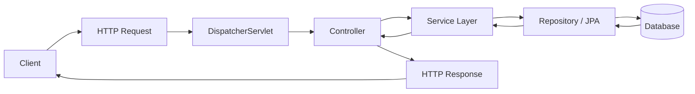
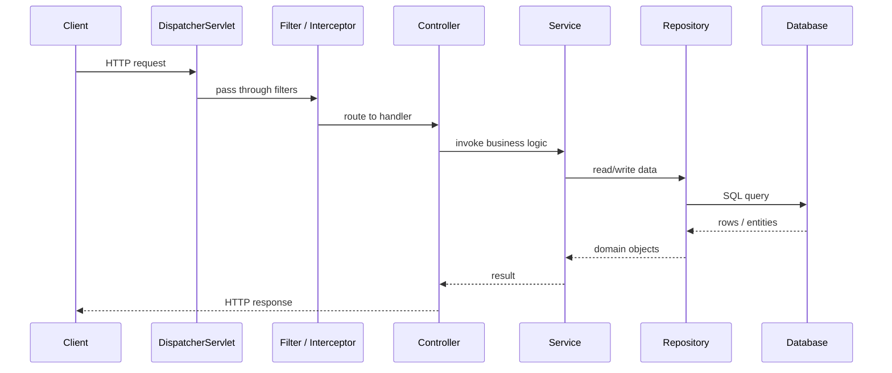
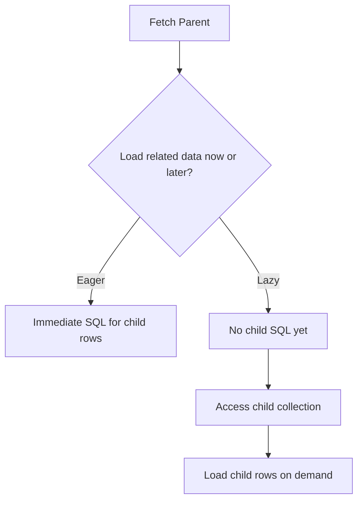
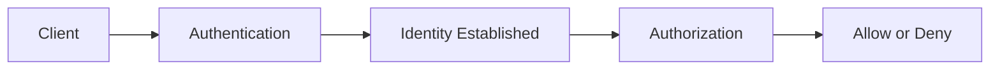

# API Observability, Request Flow, and Persistence Design

## Quick Navigation Index

Use this guide as a structured map from API fundamentals to production observability.

- [1. Why observability is essential](#1-why-observability-is-essential)
- [2. What observability means in practice](#2-what-observability-means-in-practice)
- [3. Spring Boot architecture for web APIs](#3-spring-boot-architecture-for-web-apis)
  - [3.1 Request lifecycle](#31-request-lifecycle)
  - [3.2 Mental model for request flow](#32-a-mental-model-for-the-flow-of-a-request)
  - [3.3 What each layer is doing](#33-what-each-layer-is-really-doing)
  - [3.4 JPA loading fundamentals](#34-jpa-loading-fundamentals-lazy-vs-eager)
  - [3.5 Memory aid](#35-how-to-remember-this-concept)
- [4. Actuator and runtime inspection](#4-spring-boot-actuator)
- [5. Metrics with Micrometer](#5-metrics-with-micrometer)
- [6. Distributed tracing](#6-distributed-tracing)
- [7. Logging strategy](#7-logging-strategy-for-apis)
- [8. Health, readiness, and liveness](#8-health-readiness-and-liveness)
- [9. Authentication, authorization, and API scope](#9-authentication-authorization-and-api-scope)
- [10. Security and observability](#10-spring-security-and-observability)
- [12. Observability in real deployment environments](#12-observability-in-real-deployment-environments)
- [13. Sample production setup](#13-sample-production-setup)
- [14. Best practices](#14-best-practices)
- [15. Key takeaways](#15-key-takeaways)

---

## 1. Why observability is essential

A modern REST API should not just respond to requests. It should also explain its own behavior. Observability is the practice of making an application understandable in production by exposing signals that reveal health, latency, errors, dependency behavior, and operational state.

In Spring Boot, observability is deeply integrated through Actuator, Micrometer, and support for OpenTelemetry. These tools allow you to instrument services for metrics, logs, traces, health checks, and runtime diagnostics.

---

## 2. What observability means in practice

Observability usually covers three pillars:

- Logs: what happened
- Metrics: how often and how much
- Traces: what path did the request take

A REST API that is observable can answer questions like:

- Is the service healthy?
- Why is latency high?
- Which endpoint is failing?
- Are database calls slow?
- Is memory or GC becoming a problem?

---

## 3. Spring Boot architecture for web APIs

A Spring Boot REST application typically includes:

- A web layer built with Spring MVC or WebFlux
- A service layer for business logic
- Repository or data-access components
- Security and validation layers
- Actuator endpoints for runtime inspection

### 3.1 Request lifecycle

A typical HTTP request goes through:

1. The servlet container receives the request.
2. Spring MVC maps the request to a controller.
3. Interceptors, filters, and security filters act on the request.
4. The controller invokes service logic.
5. The service interacts with databases, external APIs, or message brokers.
6. The response is generated and sent back to the client.

Observability tools attach to this pipeline so you can inspect each stage.

### 3.2 A mental model for the flow of a request

Think of a Spring Boot request as a journey through layers. The important idea is that each layer has a role, and the request becomes more meaningful as it moves from transport to business logic to persistence.



A slightly more detailed view looks like this:



### 3.3 What each layer is really doing

- Transport layer: the client sends an HTTP request. The server receives it and prepares to route it.
- Dispatcher layer: Spring decides which controller should handle the request.
- Filter and interceptor layer: authentication, logging, validation, request tracing, and cross-cutting concerns happen here.
- Controller layer: converts the external HTTP request into an internal application command.
- Service layer: contains business rules and orchestration. This is where most real work happens.
- Repository layer: communicates with the database through JPA, JDBC, or another persistence abstraction.
- Response layer: data is converted to JSON, status codes are set, and the client receives the reply.

A useful memory aid is:

- Request enters from the outside.
- Spring routes it.
- The service makes decisions.
- The repository talks to storage.
- The response flows back.

### 3.4 JPA loading fundamentals: lazy vs eager

JPA is not just about saving and fetching data. It is also about when related data is loaded.

The central idea is simple:

- Lazy loading = load the related data later, only when it is actually needed.
- Eager loading = load the related data immediately, along with the parent entity.

#### 3.4.1 Why this matters

If you fetch a parent entity and also fetch all its children, you may trigger a large amount of extra database work. If you fetch only the parent and delay the children until needed, you can reduce memory usage and improve initial response time.



#### 3.4.2 The default behavior in JPA

A very important fact to remember is that JPA defaults differ by association type:

- `@ManyToOne` and `@OneToOne` are typically EAGER by default.
- `@OneToMany` and `@ManyToMany` are typically LAZY by default.

That means a many-to-one association is often fetched immediately, while a one-to-many collection is usually fetched only when accessed.

#### 3.4.3 Example

```java
@Entity
public class Order {
    @Id
    private Long id;

    @ManyToOne(fetch = FetchType.LAZY)
    private Customer customer;

    @OneToMany(mappedBy = "order", fetch = FetchType.LAZY)
    private List<OrderItem> items = new ArrayList<>();
}
```

Here:

- `customer` is not loaded immediately unless you explicitly access it.
- `items` are also deferred until the collection is touched.

#### 3.4.4 What lazy loading really means

Under the hood, JPA often creates a proxy object. The database query is not executed until the association is actually accessed. This helps reduce unnecessary work.

#### 3.4.5 What eager loading means

With eager loading, the persistence provider tries to fetch the association as part of the original query. This can be useful when the related data is always required and the association is small.

#### 3.4.6 The classic problem: N+1 queries

This is one of the most common JPA misunderstandings.

Suppose you fetch 100 orders, and for each order you access its items:

```java
List<Order> orders = orderRepository.findAll();
for (Order order : orders) {
    System.out.println(order.getItems().size());
}
```

This can lead to:

- 1 query to fetch the 100 orders
- plus 100 more queries to fetch items for each order

That is why understanding fetch strategy matters so much. Lazy loading can avoid this in some cases, but a careless access pattern can still create the same issue.

#### 3.4.7 Rule of thumb

- Use lazy loading for large collections or optional relationships.
- Use eager loading for small, always-required associations.
- Be careful with `toString()`, `equals()`, or logging that touches lazy fields unexpectedly.
- When you suspect performance problems, inspect the generated SQL and the number of queries.

### 3.5 How to remember this concept

A simple way to remember the idea is:

- Request flow = how data moves through the application.
- Fetch strategy = when related data is pulled from the database.
- Lazy = later.
- Eager = now.

If you can picture the flow as a chain from client to controller to service to repository to database, and then remember that JPA controls when the next relationship is loaded, the whole topic becomes much easier to reason about.

---

## 4. Spring Boot Actuator

Actuator provides production-ready endpoints for monitoring and managing the application.

### 4.1 Core endpoints

Common endpoints include:

- `/actuator/health`
- `/actuator/info`
- `/actuator/metrics`
- `/actuator/loggers`
- `/actuator/env`
- `/actuator/threaddump`
- `/actuator/heapdump`

### 4.2 Health endpoint

The health endpoint is often the first signal used in deployment pipelines and orchestrators.

It can expose:

- `UP`
- `DOWN`
- `OUT_OF_SERVICE`

You can create custom health indicators to check database availability, downstream service health, or business conditions.

### 4.3 Info endpoint

The info endpoint can expose build information, Git details, or custom metadata.

Example:

```properties
management.endpoints.web.exposure.include=health,info,metrics,prometheus
management.endpoint.health.show-details=when_authorized
```

---

## 5. Metrics with Micrometer

Micrometer is the standard metrics facade in Spring Boot.

It allows you to collect metrics from:

- JVM
- HTTP requests
- Database connections
- Cache usage
- Custom business metrics

### 5.1 Common meter types

- Counter: counts events
- Gauge: reports current value
- Timer: measures durations
- DistributionSummary: tracks size distributions

### 5.2 Example custom metric

```java
import io.micrometer.core.instrument.MeterRegistry;
import org.springframework.stereotype.Service;

@Service
public class BillingService {
    private final MeterRegistry meterRegistry;

    public BillingService(MeterRegistry meterRegistry) {
        this.meterRegistry = meterRegistry;
    }

    public void chargeCustomer() {
        meterRegistry.counter("billing.operations", "status", "success").increment();
    }
}
```

### 5.3 Prometheus integration

Spring Boot can expose Prometheus-compatible metrics. This makes it easy to use Prometheus and Grafana in production.

Typical configuration:

```properties
management.endpoints.web.exposure.include=prometheus,metrics,health
management.prometheus.metrics.export.enabled=true
```

---

## 6. Distributed tracing

Tracing lets you follow a single request as it moves through multiple services.

### 6.1 Why tracing matters

In distributed systems, a request can cross:

- API gateway
- Authentication service
- Database
- Cache
- Message broker
- Downstream microservices

Without tracing, it is hard to identify where delay or failure occurred.

### 6.2 OpenTelemetry in Spring Boot

Spring Boot integrates with Micrometer Tracing and OpenTelemetry. You can export traces to systems like:

- Jaeger
- Zipkin
- Azure Monitor
- OpenTelemetry Collector

### 6.3 Trace propagation

A trace ID and span ID are propagated across HTTP calls and messaging systems. This allows correlation of events across services.

### 6.4 Practical trace instrumentation

You can add spans around critical operations such as:

- External API calls
- Database access
- Message publishing
- Complex business workflows

---

## 7. Logging strategy for APIs

Logs remain essential, but they should be structured and consistent.

### 7.1 Structured logging

Instead of plain free-form text, use structured fields such as:

- request ID
- user ID
- tenant ID
- endpoint
- status code
- latency

### 7.2 MDC and correlation IDs

MDC (Mapped Diagnostic Context) allows attaching request-scoped data to logs.

Example pattern:

```java
import org.slf4j.MDC;

public class RequestLoggingFilter {
    public void doFilter(HttpServletRequest request, HttpServletResponse response, FilterChain chain)
            throws IOException, ServletException {
        MDC.put("requestId", UUID.randomUUID().toString());
        try {
            chain.doFilter(request, response);
        } finally {
            MDC.clear();
        }
    }
}
```

### 7.3 Logging configuration

Use log levels carefully:

- DEBUG for investigative and development use
- INFO for normal business events
- WARN for suspicious but non-fatal conditions
- ERROR for failures

---

## 8. Health, readiness, and liveness

Modern platforms require health probes. In Kubernetes, these are crucial.

### 8.1 Liveness probe

Used to determine if the application is alive.

If the app is stuck or deadlocked, the liveness probe should fail and the container can be restarted.

### 8.2 Readiness probe

Used to determine if the application is ready to receive traffic.

Readiness should fail if:

- Database connections are not available
- External dependencies are down
- The app has not completed initialization

### 8.3 Custom health indicators

You can define custom health checks to model domain-specific readiness.

Example:

```java
import org.springframework.boot.actuate.health.Health;
import org.springframework.boot.actuate.health.HealthIndicator;
import org.springframework.stereotype.Component;

@Component
public class PaymentGatewayHealthIndicator implements HealthIndicator {
    @Override
    public Health health() {
        return Health.up().withDetail("status", "payment gateway reachable").build();
    }
}
```

---

## 9. Authentication, authorization, and API scope

Security and observability interact closely, especially in real-world APIs. A production-grade REST API must not only serve requests correctly, but also determine who is allowed to call it, what operations are permitted, and how access is controlled across users, services, and tenants.

### 9.1 What authentication means

Authentication is the process of verifying identity.

In simple terms, it answers the question:

- Who is this client?

Examples of authentication mechanisms include:

- username and password
- OAuth2 / OpenID Connect
- JWT access tokens
- API keys
- mutual TLS for service-to-service calls

In a Spring Boot application, authentication usually happens in the security filter chain before the request reaches business logic.

### 9.2 What authorization means

Authorization is the process of deciding what an authenticated identity is allowed to do.

It answers the question:

- What can this user or service access?

Examples include:

- an admin can delete users
- a regular user can only view their own orders
- a service account can read metrics but not update billing data

Authentication answers “who are you?”, while authorization answers “what are you allowed to do?”.

### 9.3 Why both are needed

A system can have identity without permission, and permission without identity.

For example:

- a request may be authenticated but not authorized
- a request may be anonymous and therefore fail authorization checks
- a service may be allowed to call one endpoint but not another

Both mechanisms are essential for secure systems.

### 9.4 A simple mental model



A practical interpretation is:

- authentication checks identity
- authorization checks permission
- the API enforces both before business logic proceeds

### 9.5 Why API scope matters

The scope of an API refers to the boundary of what the API is responsible for and what it exposes.

This includes:

- which resources the API manages
- which operations are supported
- which clients are allowed to use it
- what data is visible or editable
- what responsibilities belong to the API versus other services

A well-defined API scope prevents confusion and reduces accidental coupling between services.

### 9.6 What API scope means in practice

An API scope can be narrow or broad.

Examples:

- a user service API may manage profile, address, and preferences
- an order service API may manage order placement, cancellation, and status
- a gateway API may route requests to many downstream services but should not implement business logic itself

If the scope is too broad, the API becomes hard to maintain. If it is too narrow, clients may need many services just to complete a simple workflow.

### 9.7 Why scope is needed

A clear API scope is needed because it helps with:

- separation of concerns
- maintainability
- security boundaries
- scalability
- easier testing and monitoring

It also helps teams understand who owns which behavior.

### 9.8 Common API scope design questions

When designing an API, you should ask:

- What domain does this API own?
- Which entities does it manage?
- What data should be exposed externally?
- Which clients should be allowed to use it?
- Should it support only CRUD, or also workflow-driven operations?
- What should be delegated to other services?

### 9.9 Authentication and authorization in Spring Boot

Spring Security is commonly used to enforce these concerns.

Typical layers include:

- authentication filter
- user details service
- password encoder
- authorization rules
- method-level security

Example concepts include:

- `@PreAuthorize("hasRole('ADMIN')")`
- role-based access control
- permission-based access control
- JWT-based stateless authentication

### 9.10 Security best practices for APIs

You should:

- validate tokens and signatures properly
- avoid exposing sensitive fields in responses
- use least-privilege access
- log authentication and authorization events carefully
- protect against brute-force and abuse patterns
- use HTTPS everywhere
- rotate secrets and tokens regularly

### 9.11 Observability of security events

Security events are also observability signals.

Useful signals include:

- failed login attempts
- token validation failures
- access denied events
- unusual request patterns
- suspicious IP activity

These are important for both debugging and auditing.

### 9.12 A practical example

Suppose an API exposes `/orders/{id}`.

The authentication layer checks whether the caller is a valid user.

The authorization layer then checks whether that user is allowed to view the order.

Possible outcomes:

- the user owns the order and can view it
- the user is an admin and can view it
- the user is not authorized and gets `403 Forbidden`
- the user is unauthenticated and gets `401 Unauthorized`

This distinction is very important in interviews and production design discussions.

### 9.13 Why this matters for system design

In distributed systems, security is not only about one endpoint. It is about:

- trust boundaries
- service-to-service access
- tenant isolation
- least privilege
- auditability

A good API design makes these controls explicit and understandable.

### 9.14 Summary

The core ideas are:

- authentication verifies identity
- authorization decides permission
- API scope defines the boundary of responsibility and exposure
- security and observability should be designed together

A secure API is not just one that works. It is one that is correct, controlled, auditable, and safe to operate in production.

---

## 10. Spring Security and observability

Security and observability interact closely.

### 10.1 Why security matters for telemetry

Sensitive information in logs or traces can leak credentials, tokens, or personal data.

You should:

- Avoid logging raw tokens
- Redact secrets
- Limit sensitive fields in exception payloads
- Apply consistent authorization and authentication logging

### 10.2 Security filter chain and monitoring

Spring Security uses a filter chain. Observability should include visibility into authentication and authorization events.

Common concerns:

- Repeated failed logins
- Access denied events
- CSRF or token validation failures
- Session anomalies

---

## 11. Resilience and observation

Observation is not only about health. It also includes resilience patterns.

### 10.1 Timeouts

Set timeouts on outgoing calls to prevent cascading failures.

### 10.2 Retries

Use retries carefully, especially for non-idempotent operations.

### 10.3 Circuit breakers

Circuit breakers prevent a failing dependency from overwhelming the application.

### 10.4 Bulkheads

Bulkheads isolate critical operations so one failure does not consume all resources.

These patterns are easier to reason about when metrics and traces are present.

---

## 12. Observability in real deployment environments

In production, you usually wire observability into a broader stack:

- Prometheus scrapes metrics
- Grafana visualizes dashboards
- Loki or ELK handles logs
- Jaeger or Tempo handles traces
- Alertmanager triggers alerts

### 11.1 Recommended signals

A well-instrumented API should expose:

- Request count
- Error count
- p50/p95/p99 latency
- JVM heap usage
- GC pause durations
- Database latency
- Queue depth or backlog
- Availability percentage

---

## 13. Sample production setup

A typical Spring Boot configuration might look like:

```properties
server.port=8080
management.endpoints.web.exposure.include=health,info,metrics,prometheus,loggers
management.endpoint.health.probes.enabled=true
management.health.livenessstate.enabled=true
management.health.readinessstate.enabled=true
management.metrics.tags.application=${spring.application.name}
```

This gives you:

- health endpoints for orchestration
- metrics for dashboards
- logs with correlation context
- readiness/liveness for deployment safety

---

## 14. Best practices

1. Expose health endpoints carefully and make them meaningful.
2. Use structured logging with correlation IDs.
3. Prefer Micrometer over ad hoc metrics.
4. Emit custom business metrics for operational insight.
5. Trace external calls and database work.
6. Avoid logging secrets or sensitive PII.
7. Treat observability as a core feature, not an afterthought.

---

## 15. Key takeaways

Spring Boot observability is not just about dashboards. It is about turning an API into a system that can explain itself when things go wrong.

The essential building blocks are:

- Actuator for runtime inspection
- Micrometer for metrics
- OpenTelemetry and tracing for request flow visibility
- Structured logging with correlation context
- Health probes for runtime orchestration

If you build observability into the API from the beginning, you reduce mean time to detection and mean time to resolution dramatically.
