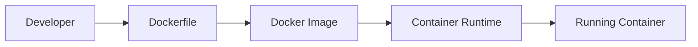
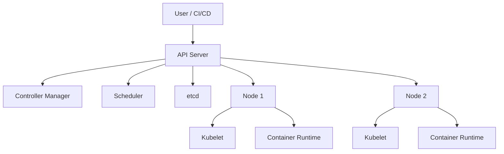
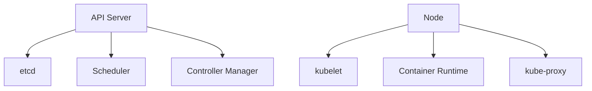

# Container Orchestration Cheat Sheet

## Quick Navigation Index

Use this cheat sheet as a fast review map for Docker and Kubernetes concepts.

- [1. Why Docker and Kubernetes matter](#1-why-docker-and-kubernetes-matter)
- [2. Architecture overview](#2-architecture-overview)
  - [2.1 Docker architecture](#21-docker-architecture)
  - [2.2 Kubernetes architecture](#22-kubernetes-architecture)
- [3. Core Docker concepts](#3-core-docker-concepts)
- [4. Docker commands](#4-docker-commands-cheat-sheet)
- [5. Docker best practices](#5-docker-best-practices)
- [6. Kubernetes core concepts](#6-kubernetes-core-concepts)
- [7. Kubernetes architecture in detail](#7-kubernetes-architecture-in-detail)
- [8. Kubernetes object lifecycle](#8-kubernetes-object-lifecycle)
- [9. Kubernetes commands](#9-kubernetes-commands-cheat-sheet)
- [10. Kubernetes networking](#10-kubernetes-networking-concepts)
- [11. Kubernetes storage](#11-kubernetes-storage-concepts)
- [12. Interview-focused definitions](#12-common-interview-focused-definitions)
- [13. Docker interview questions](#13-commonly-asked-docker-interview-questions)
- [14. Kubernetes interview questions](#14-commonly-asked-kubernetes-interview-questions)
- [15. Final retention summary](#15-final-retention-summary)
- [16. Quick revision checklist](#16-quick-revision-checklist)

---

## 1. Why Docker and Kubernetes matter

Docker and Kubernetes are the foundation of modern cloud-native application deployment.

- Docker packages applications into portable containers.
- Kubernetes orchestrates those containers at scale.
- Together they make deployments repeatable, scalable, and easier to manage.

A simple way to remember this is:

- Docker = packaging and running applications in containers
- Kubernetes = managing containers across machines

---

## 2. Architecture overview

### 2.1 Docker architecture

Docker is a containerization platform. It helps you build, ship, and run applications in isolated environments called containers.



### 2.2 Kubernetes architecture

Kubernetes is a container orchestration system. It manages containerized applications across a cluster of machines.



---

## 3. Core Docker concepts

### 3.1 Dockerfile

A Dockerfile is a text file that contains instructions to build a container image.

Example:

```dockerfile
FROM python:3.11-slim
WORKDIR /app
COPY . .
RUN pip install -r requirements.txt
CMD ["python", "app.py"]
```

### 3.2 Image

An image is a read-only template used to create containers.

Think of it as the blueprint.

### 3.3 Container

A container is a running instance of an image.

Think of it as the live process created from the blueprint.

### 3.4 Registry

A registry stores and distributes container images.

Examples:

- Docker Hub
- Azure Container Registry
- Amazon ECR
- Google Artifact Registry

### 3.5 Volume

A volume is persistent storage attached to a container.

Used for:

- database persistence
- logs
- shared files

### 3.6 Network

Docker networks allow containers to communicate with each other.

Common network types:

- bridge
- host
- overlay

### 3.7 Layered filesystem

Docker images are built in layers. Each instruction in a Dockerfile creates a new layer.

This gives Docker benefits like:

- reuse
- caching
- efficient storage

---

## 4. Docker commands cheat sheet

### 4.1 Build and run

```bash
docker build -t myapp:1.0 .
docker run -d -p 8080:80 --name myapp myapp:1.0
```

### 4.2 Manage containers

```bash
docker ps
docker ps -a
docker stop myapp
docker rm myapp
docker logs myapp
docker exec -it myapp sh
```

### 4.3 Images and registry

```bash
docker images
docker rmi myapp:1.0
docker pull nginx
docker push myrepo/myapp:1.0
```

### 4.4 Volumes and networks

```bash
docker volume ls
docker network ls
docker network inspect bridge
```

### 4.5 Docker Compose

```bash
docker compose up
docker compose down
docker compose logs
```

---

## 5. Docker best practices

1. Keep images small.
2. Use multi-stage builds.
3. Avoid storing secrets in images.
4. Run containers as non-root when possible.
5. Use health checks.
6. Prefer immutable images.
7. Use environment variables for configuration.

---

## 6. Kubernetes core concepts

### 6.1 Cluster

A Kubernetes cluster is a group of machines working together.

It includes:

- control plane
- worker nodes

### 6.2 Node

A node is a worker machine in the cluster.

Each node runs:

- kubelet
- container runtime
- pods

### 6.3 Pod

A pod is the smallest deployable unit in Kubernetes.

A pod can contain:

- one container or multiple tightly coupled containers

### 6.4 Deployment

A Deployment manages stateless applications.

It provides:

- rolling updates
- rollbacks
- replica management

### 6.5 StatefulSet

A StatefulSet manages stateful applications.

It is used for:

- databases
- distributed systems
- ordered deployments

### 6.6 Service

A Service exposes pods internally or externally.

Common service types:

- ClusterIP
- NodePort
- LoadBalancer

### 6.7 ConfigMap

A ConfigMap stores non-sensitive configuration data.

### 6.8 Secret

A Secret stores sensitive information like passwords and tokens.

### 6.9 Ingress

Ingress manages external access to services via HTTP/HTTPS.

### 6.10 Namespace

A Namespace isolates resources within a cluster.

### 6.11 PersistentVolume and PersistentVolumeClaim

These provide storage for stateful workloads.

- PersistentVolume: actual storage resource
- PersistentVolumeClaim: request for storage

---

## 7. Kubernetes architecture in detail

### 7.1 Control plane components

The control plane makes decisions about the cluster.

Components:

- API Server: front door for all cluster operations
- etcd: distributed key-value store for cluster state
- Scheduler: decides which node should run a pod
- Controller Manager: watches resources and reconciles desired state

### 7.2 Worker node components

Worker nodes run the actual application workload.

Components:

- kubelet: agent that ensures containers are running as expected
- container runtime: Docker, containerd, or CRI-compatible runtime
- kube-proxy: handles networking and service routing



---

## 8. Kubernetes object lifecycle

A Kubernetes object usually goes through:

1. create manifest
2. apply manifest to the cluster
3. API server stores the desired state
4. controllers reconcile the object
5. pods are scheduled and launched
6. health and readiness are monitored

This is often described as:

- declarative model: you say what you want
- controller loop: Kubernetes works to make it true

---

## 9. Kubernetes commands cheat sheet

### 9.1 Basic commands

```bash
kubectl get pods
kubectl get deployments
kubectl get svc
kubectl get ns
kubectl describe pod mypod
kubectl logs mypod
kubectl exec -it mypod -- sh
```

### 9.2 Create and apply resources

```bash
kubectl apply -f deployment.yaml
kubectl delete -f deployment.yaml
kubectl create namespace dev
```

### 9.3 Scaling

```bash
kubectl scale deployment myapp --replicas=3
kubectl autoscale deployment myapp --min=2 --max=5 --cpu-percent=70
```

### 9.4 Rollouts and rollback

```bash
kubectl rollout status deployment/myapp
kubectl rollout history deployment/myapp
kubectl rollout undo deployment/myapp
```

---

## 10. Kubernetes networking concepts

### 10.1 Service discovery

Pods are ephemeral. Services provide stable access points.

### 10.2 ClusterIP

Internal-only access within the cluster.

### 10.3 NodePort

Exposes a service on a port of each node.

### 10.4 LoadBalancer

Exposes the service via an external load balancer.

### 10.5 Ingress

Ingress routes HTTP/HTTPS traffic to services based on host and path.

---

## 11. Kubernetes storage concepts

### 11.1 Why storage is special

Containers are ephemeral. If a container dies, its filesystem is lost unless it uses persistent storage.

### 11.2 PersistentVolume

Represents storage in the cluster.

### 11.3 PersistentVolumeClaim

A request by a workload for storage.

### 11.4 Example use cases

- databases
- file systems
- shared caches

---

## 12. Common interview-focused definitions

### Docker

- Dockerfile: build instructions for an image
- Image: immutable packaging artifact
- Container: running instance of an image
- Layer: reusable filesystem change
- Volume: persistent storage
- Registry: repository for images
- Docker Compose: tool to define and run multi-container applications

### Kubernetes

- Pod: smallest deployable unit
- Deployment: manages replicas and rolling updates
- StatefulSet: manages stateful workloads
- Service: stable network endpoint for pods
- Ingress: HTTP/HTTPS routing
- ConfigMap: non-sensitive config
- Secret: sensitive config
- Namespace: logical isolation
- PersistentVolume: cluster storage resource
- PersistentVolumeClaim: storage request

---

## 13. Commonly asked Docker interview questions

### 13.1 What is the difference between a Docker image and a container?

An image is a static blueprint. A container is a running runtime instance created from the image.

### 13.2 What is a Dockerfile and what are common instructions?

A Dockerfile contains the instructions used to build an image. Common instructions include `FROM`, `COPY`, `RUN`, `CMD`, `ENTRYPOINT`, and `EXPOSE`.

### 13.3 What is the difference between `CMD` and `ENTRYPOINT`?

`CMD` provides default arguments for the container process. `ENTRYPOINT` defines the main executable. They are often used together for flexible startup behavior.

### 13.4 Why are Docker containers lightweight?

Containers share the host kernel and use layered filesystems, which makes them lighter than full virtual machines.

### 13.5 What is Docker Compose used for?

Docker Compose is used to define and run multi-container applications with a single YAML configuration file.

### 13.6 What is the use of volumes in Docker?

Volumes persist data beyond the container lifecycle and allow data sharing between containers.

### 13.7 What is a multi-stage Docker build?

A multi-stage build uses multiple `FROM` statements to build artifacts in one stage and copy only the necessary outputs to the final image.

### 13.8 How does Docker handle networking between containers?

Docker containers can communicate through Docker-managed networks, often using container names as hostnames.

### 13.9 How do you reduce image size?

Use smaller base images, remove unnecessary files, combine commands, and use multi-stage builds.

### 13.10 What is the difference between `docker run` and `docker create`?

`docker run` creates and starts a container. `docker create` creates it without starting it.

### 13.11 Why do we use `.dockerignore`?

It prevents unnecessary files from being sent to the Docker build context, improving build speed and reducing image size.

### 13.12 How is Docker different from a virtual machine?

Docker containers share the host OS kernel and are lighter. Virtual machines include a full guest OS and are heavier.

### 13.13 What is a container registry?

A container registry stores and distributes container images.

### 13.14 What are health checks in Docker?

Health checks allow the runtime to monitor whether a container is healthy and report status.

### 13.15 What happens if a Docker container exits unexpectedly?

It stops running, and the container state changes. Logs and exit status can be inspected with Docker commands.

---

## 14. Commonly asked Kubernetes interview questions

### 14.1 What is the difference between a pod and a container?

A container is a runtime unit. A pod is the smallest Kubernetes object that can host one or more containers.

### 14.2 What is the difference between a Deployment and a StatefulSet?

A Deployment is for stateless applications. A StatefulSet is for stateful workloads with stable identity and ordered behavior.

### 14.3 What is a Service in Kubernetes?

A Service provides a stable network endpoint to access a set of pods.

### 14.4 What is the role of the kube-scheduler?

The scheduler decides which node should run a newly created pod based on resource availability and constraints.

### 14.5 What is etcd used for?

etcd stores the cluster’s desired state and configuration data.

### 14.6 What is the difference between ClusterIP, NodePort, and LoadBalancer?

- ClusterIP exposes a service only inside the cluster.
- NodePort exposes it on each node’s IP.
- LoadBalancer exposes it through an external cloud load balancer.

### 14.7 What is the difference between ConfigMap and Secret?

ConfigMap stores non-sensitive config. Secret stores sensitive data.

### 14.8 What is an Ingress controller?

An Ingress controller implements routing rules for HTTP and HTTPS traffic into the cluster.

### 14.9 What is the purpose of a readiness probe?

A readiness probe tells Kubernetes when a pod is ready to receive traffic.

### 14.10 What is the purpose of a liveness probe?

A liveness probe tells Kubernetes whether the application is still alive and should be restarted if not.

### 14.11 What is the difference between a ReplicaSet and a Deployment?

A ReplicaSet ensures a desired number of pod replicas. A Deployment manages ReplicaSets and rolling updates.

### 14.12 What is a namespace used for?

Namespaces provide logical isolation of resources in a cluster.

### 14.13 What is a PersistentVolumeClaim?

It is a request for storage by a workload.

### 14.14 Why do we need a Service even if pods already have IP addresses?

Pods are ephemeral and may be replaced. Services provide stable endpoints and load balancing.

### 14.15 What is rolling update in Kubernetes?

A rolling update gradually replaces old pods with new ones to avoid downtime.

### 14.16 What happens when a pod fails?

The controller manager notices the mismatch and recreates the pod according to the desired state.

### 14.17 What is the difference between imperative and declarative Kubernetes management?

Imperative commands directly tell Kubernetes what to do. Declarative manifests define the desired state and Kubernetes reconciles it.

### 14.18 What is the purpose of kube-proxy?

It helps implement service networking and routing inside the cluster.

### 14.19 What is the difference between a container restart and a pod restart?

A container restart restarts one container inside a pod. A pod restart recreates the pod and its containers.

### 14.20 What is a DaemonSet?

A DaemonSet ensures a pod runs on every node or a subset of nodes.

---

## 15. Final retention summary

If you want to remember Docker and Kubernetes quickly, keep these ideas in mind:

- Docker builds and runs containers.
- Kubernetes manages containers at scale.
- A pod is the basic unit of scheduling.
- A deployment handles replication and updates.
- A service gives stable network access.
- Ingress handles external traffic routing.
- ConfigMaps and Secrets handle configuration and secrets.
- Persistent storage is required for stateful workloads.

A simple memory sentence is:

- Docker packages.
- Kubernetes orchestrates.
- Services connect.
- Storage persists.

---

## 16. Quick revision checklist

- Can you explain the difference between image and container?
- Can you explain the role of a pod, deployment, service, and ingress?
- Can you describe how a pod is scheduled to a node?
- Can you explain why Kubernetes uses controllers?
- Can you distinguish Docker Compose from Kubernetes?
- Can you describe why StatefulSet is needed for databases?
